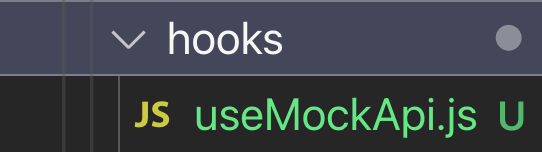

If you're just getting started with React, or perhaps you've been working in a codebase that still makes extensive use of class components, you may not be familiar yet with React Hooks.

<h3>Hooks you say?</h3>

Introduced with React 16.8, React Hooks are a way to reuse stateful logic between components. While it had always been possible to write a React component as a function prior to hooks, those components could only be used as wrappers or as "stateless" components. With hooks, you now have the full power of React available to use in your functional components, meaning you can write purely functional React, leaving behind those messy, confusing and quick-to-grow Class components!

React has some useful pre-packaged hooks ready to use out of the box, such as useState.

<h3>useState</h3>

The useState hook, as you can probably imagine, allows you to use state within your functional component! Here's an example of a functional component capable of holding state thanks to the useState hook:

```js
import React, { useState } from "react"

export default function TestComponent() {
  const [counter, setCounter] = useState(0)

  return (
    <div>
      <div>{counter}</div>
      <button onClick={() => setCounter(counter + 1)}>
        Click To Increment
      </button>
    </div>
  )
}
```

This yields the following:


Which is great! That's just a super simple example of how to use state with the useState hook in a functional React component. So rather than write a bloated class component and constantly make mistakes by leaving the `this.` off `this.state`, we avoid that for this much sleeker, functional alternative.

<h2>Ok, but can we make our own hooks?</h2>

Damn skippy. That's the whole point of this blog post! So what's a good example of a time when you need to do some repeatable behavior in your code and you get a bit tired of having to keep writing over and over?

Let's say you're building out a front end on a web app and you want to grab some mock data so your UI doesn't feel so drab and empty. You like using the wonderful jsonplaceholder website, but you get kind of annoyed having to keep writing the fetch logic to grab what you need everytime you want something different.

**_Let's turn it into a reusable hook!_**

<h2>useMockApi</h2>

We'll start by creating a new folder in our project called hooks (if we don't already have one). Next we'll create a new file called useMockApi.



Within our useMockApi hook file we'll create this hook:

```js
import { useEffect, useState } from "react"

export default function useMockApi(type, limit) {
  const [data, setData] = useState(null)
  const baseURL = `https://jsonplaceholder.typicode.com/`

  useEffect(() => {
    let controller = new AbortController()
    ;(async () => {
      try {
        const response = await fetch(`${baseURL}${type}?_limit=${limit}`, {
          signal: controller.signal,
        })
        setData(await response.json())
        controller = null
      } catch (e) {
        console.log(e)
      }
    })()
    return () => controller?.abort()
  }, [type, limit, baseURL])

  return [data]
}
```

There's a bit going on here so let's dive in!

First up, you'll notice our hook has some parameters:

```js
export default function useMockApi(type, limit) {
```

Those will give us the ability to tweak the API request to our liking.
The 'type' param will correspond to the resource we're requesting, so in the case of the JSON placeholder API, we can request things like:

<ul>
<li>
  users
</li>
<li>
  todos
</li>
<li>
  photos
</li>
<li>
  posts
</li>
<li>
  albums
</li>
<li>
  comments
</li>
</ul>

For the sake of brevity, I've only included a type and a limit here, but you can obviously add more params to pass into your request as your situation calls for it.

Next up we have a limit param, which is just a number. That will limit the response size we get back, depending on how much mock data we need.

Following that, you can see we actually use the useState hook right here in our custom hook!

```js
const [data, setData] = useState(null)
```

This will allow us to hold the data we're fetching in local state so we can return it later for use within our wrapping component!

Now comes our fetching function:

```js
useEffect(() => {
  let controller = new AbortController()
  ;(async () => {
    try {
      const response = await fetch(`${baseURL}${type}?_limit=${limit}`, {
        signal: controller.signal,
      })
      setData(await response.json())
      controller = null
    } catch (e) {
      console.log(e)
    }
  })()
  return () => controller?.abort()
}, [type, limit, baseURL])
```

At the beginning of this post, I mentioned React including some useful pre-made hooks. Here we're using perhaps the most popular pre-made React hook, the `useEffect` hook.

`useEffect` takes a function as it's first argument and a dependency array as it's second argument. It runs after the first render of a component and after every update, effectively replacing the componentDidMount lifecycle method. So basically, it tells React "do the this function I give you whenever this component renders.".

The second argument - the dependency array - takes a list of any props that we want to 'watch'. If we leave that array empty, `useEffect` will simply run whenever the component renders. If we pass props to watch into that array, we will ONLY run `useEffect` if there are changes to those specified props.

As you can see, with our `useEffect` we are watching the `type`, `limit` and `baseURL` props. This way, we are telling that `useEffect` to only run if one of those props changes.

```js
}, [type, limit, baseURL])
```

The first thing we do within our `useEffect` function is instantiate an AbortController constructor.

```js
let controller = new AbortController()
```

We do this because later on inside our useEffect call, we are going to need to properly halt any request we've made within the cleanup function we return from `useEffect`, so we are not unintentionally updating any unmounted components.

<i><b><center>Note: If you are familiar with class components, the anonymous function we return from useEffect is the replacement for the old `componentWillUnmount()` lifecycle method. Asynchronous fetch calls are good examples of times we would want to use that clean up function.</center></b></i>

Next we have the function we're telling `useEffect` to run, which is an asynchronous fetch call to the JSON placeholder API.

```js
;(async () => {
  try {
    const response = await fetch(`${baseURL}${type}?_limit=${limit}`, {
      signal: controller.signal,
    })
    setData(await response.json())
    controller = null
  } catch (e) {
    console.log(e)
  }
})()
```

We wrap this in an IIFE (Immediately Invoked Function Expression) so the fetch is immediately run upon `useEffect` triggering. We also set the `{ signal: controller.signal }` option on our fetch request. This again, will come into play when we are cleaning up our `useEffect` call.

One nice bonus you get from storing this fetch logic in a custom hook is only having to set up the request configuration once! So all your header configuration for these requests lives here while you interface with just the resulting data in whatever component you'd like!
